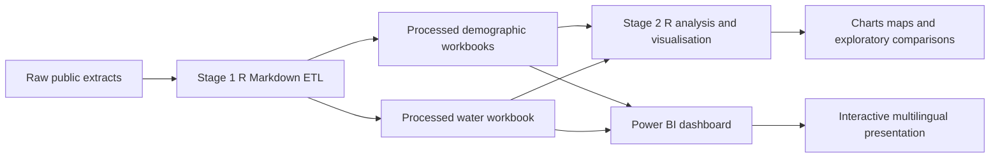

# Spain Water and Demographic Dynamics

> An end-to-end R and Power BI portfolio project that prepares public Spanish demographic and water-service data, analyses national and regional patterns, and presents them through an interactive multilingual dashboard.

[](dashboard/images/Water_Resources_Analysis_Graphs.png)

## Why this project

Population change and water management are often discussed separately. This Bachelor thesis brings the two domains into one analytical workflow: long-run population, births, deaths and migration are examined alongside water supply, distribution, availability and household-use indicators. The purpose is not to prove that one domain causes the other. Instead, it creates a structured evidence base for comparing demographic dynamics and water-service indicators across Spanish territories and time.

The thesis frames the work around demographic change, internal and external migration, and the need for adaptive water management in a country with material territorial differences. It uses public statistical extracts, R-based transformation and visual analysis, and a Power BI dashboard to make the results accessible. See the [original thesis](report/bachelor-thesis-es.pdf) for the academic context and the [project overview](docs/project-overview.md) for the scope, objectives and professional competencies.

## Scope at a glance

| Dimension | Coverage |
| --- | --- |
| Demography | 1975-2021 for population, births and deaths; migration fields are populated where source coverage is available |
| Water-service data | 2000-2020 |
| Geography | Spain, 19 autonomous-community level entries, and 53 provincial-level entries in the processed data |
| Core topics | Population, births, deaths, internal and external migration, density, water supply, distribution, availability, household allocation and per-capita indicators |
| Deliverables | Reproducible R Markdown stages, processed workbooks, Power BI report, six dashboard screenshots and the original Bachelor thesis |

The water data describe supply, registered and distributed volumes, availability and allocation. They do not establish a reservoir-level series and should not be described as reservoir data.

## Objectives

The project was designed to:

1. prepare heterogeneous public demographic and water tables for analysis;
2. examine national and regional population dynamics, including births, deaths and migration;
3. describe water supply, distribution and availability over time and across autonomous communities;
4. construct transparent comparative indicators, such as density, migration rate, water efficiency, water per square kilometre and household consumption per inhabitant; and
5. communicate the results through static R visualisations and an interactive Power BI dashboard.

## Workflow



Stage 1, [01_prepare_datasets.Rmd](scripts/01_prepare_datasets.Rmd), ingests original Excel extracts, standardises structures and territorial names, joins datasets, derives indicators and writes processed workbooks. Stage 2, [02_analyse_and_visualise.Rmd](scripts/02_analyse_and_visualise.Rmd), reads those processed files to create national time series, heat maps, choropleth maps and descriptive cross-domain scatterplots. The independent [table generator](scripts/Tablas_TFG.Rmd) produces formatted reference tables.

A detailed account of inputs, transformations and outputs is available in [Data sources and ETL](docs/data-sources-and-etl.md). The exact analytical views and the limits of their interpretation are described in [Analysis and findings](docs/analysis-and-findings.md).

## Main processed datasets

| Workbook | Grain and period | Main content |
| --- | --- | --- |
| [Poblacion_Provincias.xlsx](data/processed/Poblacion_Provincias.xlsx) | Province and year, 1975-2021 | Total population, sex, births, deaths, migration, area, density, rates and population variation |
| [Poblacion_Comunidades.xlsx](data/processed/Poblacion_Comunidades.xlsx) | Autonomous community and year, 1975-2021 | Community population, density, demographic flows, rates and 2, 4 and 10 year variations |
| [Poblacion_Edad.xlsx](data/processed/Poblacion_Edad.xlsx) | Province, year and ten-year age band, 1975-2021 | Total population, men and women for population-pyramid analysis |
| [Agua_España.xlsx](data/processed/Agua_España.xlsx) | Autonomous community and year, 2000-2020 | Supply, registered and distributed water, unregistered water, allocation, availability and water indicators |

The workflow also produces [Tabla_Final.xlsx](data/processed/Tabla_Final.xlsx), an integrated autonomous-community comparison table for 2000-2020, and [Tablas.docx](data/processed/Tablas.docx), a formatted table output.

## Selected ETL and indicator work

The preparation stage reshapes year-wide source tables into analysis-ready records, removes non-data rows, standardises province and autonomous-community names, combines Ceuta and Melilla for the community-level water workflow, and creates a national total where required. It joins demographic flows to population records, aggregates territorial area, and uses `zoo::na.approx` to interpolate specific missing water observations for 2015, 2017 and 2019.

Derived fields include population density, birth and death rates, a net migration rate, demographic variations, water-distribution efficiency, water supplied per square kilometre, household supply per inhabitant and multi-year water variations. These calculations are documented with formulas and data lineage in [Data sources and ETL](docs/data-sources-and-etl.md).

## Analysis areas and verified observations

The analysis is descriptive and visual. The following observations are traceable to the thesis and the R Markdown sections cited in the detailed findings page:

- National population rises across the long series, while the thesis identifies periods of slower growth and temporary decline in the early 2010s. [Thesis, Chapter 6.1](report/bachelor-thesis-es.pdf#page=52)
- The thesis describes falling births and rising deaths as an important feature of later demographic dynamics, with migration helping to offset demographic balance in parts of the series. [Thesis, PDF p. 56](report/bachelor-thesis-es.pdf#page=56)
- Andalusia, Catalonia, the Community of Madrid and the Valencian Community are identified in the thesis as large and comparatively dynamic population centres. [Thesis, PDF p. 58](report/bachelor-thesis-es.pdf#page=58)
- The processed water series covers 2000-2020 and the thesis describes an initial rise in total supply followed by decline and later stabilisation. [Thesis, PDF p. 66](report/bachelor-thesis-es.pdf#page=66)
- Registered and distributed water, unregistered water and supply to households are analysed separately; they are not interchangeable measures. [Thesis, PDF pp. 67-70](report/bachelor-thesis-es.pdf#page=67)
- The thesis reports declining potable and non-potable availability after the mid-2000s in the observed series. [Thesis, PDF p. 71](report/bachelor-thesis-es.pdf#page=71)
- Household per-capita supply is described as falling from roughly 170 litres per inhabitant per day to roughly 120-130 in later years. This is a descriptive estimate from the thesis, not a causal effect. [Thesis, PDF p. 77](report/bachelor-thesis-es.pdf#page=77)
- The R analysis includes four scatterplots juxtaposing community population with total supplied water, household supply, potable availability and non-potable availability. They are exploratory displays, not statistical tests or causal models. [Stage 2 correlation section](scripts/02_analyse_and_visualise.Rmd)

## Dashboard preview

[](dashboard/images/Population_Analysis_Graphs.png)

The Power BI report complements, rather than duplicates, the R outputs. It groups six views into population and water-resources analysis, maps and configurable tables. The screenshots and page-by-page explanation are available in [Power BI dashboard](docs/power-bi-dashboard.md).

## Skills demonstrated

- R data preparation and ETL design
- Excel-source ingestion and schema reshaping
- Data cleaning, territorial standardisation and record linkage
- Derived-indicator design and time-series interpolation
- Exploratory demographic and water-service analysis
- `ggplot2` time-series graphics, heat maps and choropleth mapping
- Geospatial comparison with `sf`, `mapSpain` and `cartography`
- Power BI dashboard design, slicing, drill-down and multilingual presentation
- Evidence-led technical communication and reproducibility documentation

## Repository structure

```text
.
├── scripts/       R Markdown preparation, analysis and reference-table workflows
├── data/raw/      Original public source extracts
├── data/processed/ Analysis-ready workbooks and generated tables
├── dashboard/     Power BI report and six dashboard screenshots
├── docs/          Detailed English documentation
└── report/        Original Bachelor thesis in Spanish
```

## Read more

- [Project overview](docs/project-overview.md)
- [Data sources and ETL](docs/data-sources-and-etl.md)
- [Analysis and findings](docs/analysis-and-findings.md)
- [Power BI dashboard](docs/power-bi-dashboard.md)
- [Reproducibility and limitations](docs/reproducibility-and-limitations.md)
- [Original Bachelor thesis in Spanish](report/bachelor-thesis-es.pdf)

## Data, reuse and limitations

The committed extracts are derived from public statistical material attributed in the thesis to the Spanish National Statistics Institute, with territorial-area data attributed to the Ministry for Ecological Transition and Demographic Challenge. Consult the original sources and their reuse terms before redistributing, replacing or extending extracts. The project is an academic descriptive analysis. Different periods, administrative aggregation, interpolation of selected water observations and the absence of a causal model limit the conclusions that can be drawn.

The Power BI file is included as a portfolio artefact. Its refresh source paths require an owner check in Power BI Desktop; see [the refresh guide](docs/power-bi-source-update.md).

## Licence

The original R code and code-related documentation in this repository are available under the [MIT License](LICENSE).

See [LICENSING.md](LICENSING.md) for the complete scope and exclusions.

The original datasets, processed data derived from third-party sources, Bachelor thesis PDF, Power BI files, dashboard screenshots, institutional branding and other third-party materials are not covered by the MIT License. They remain subject to the rights and terms established by their respective owners and providers.
