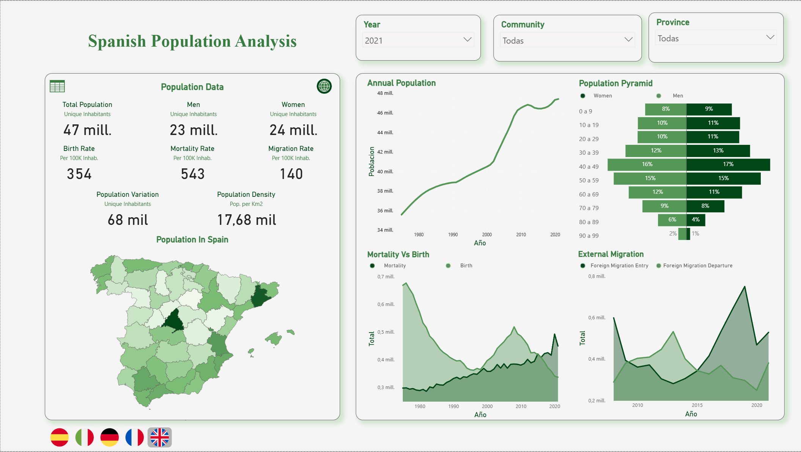
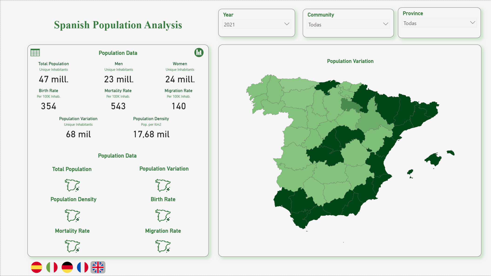
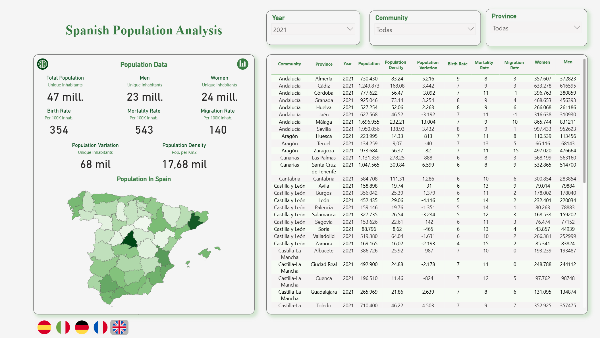
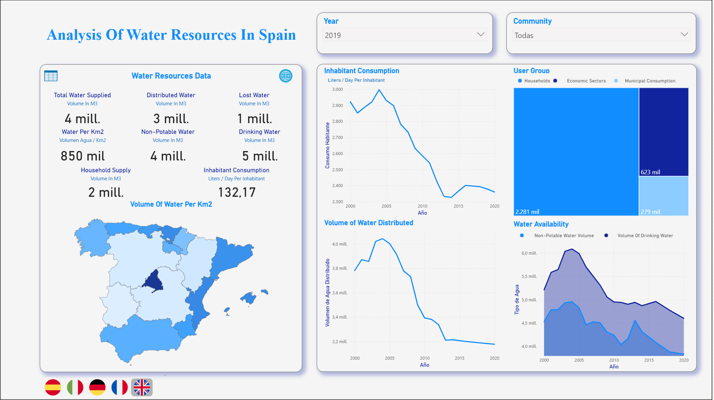
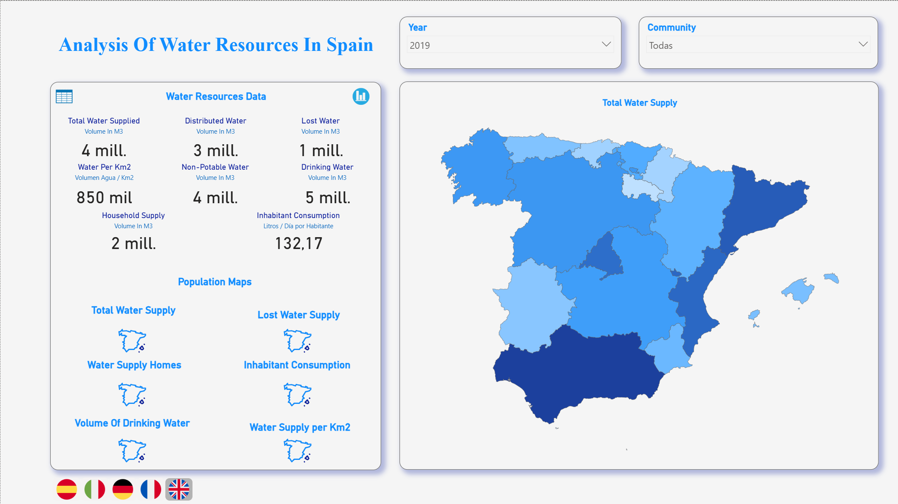
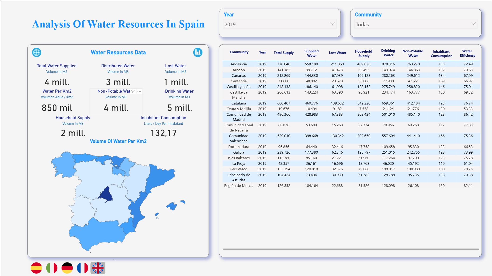

# Power BI dashboard

## Verified report structure

The committed [Dashboard_Multilanguage.pbix](../dashboard/Dashboard_Multilanguage.pbix) is a valid Power BI archive. Its report layout contains four verified pages:

1. `Poblacion España`
2. `Recursos Hidricos`
3. `Mapas de Poblacion España`
4. `Mapas de Recursos Hidricos`

The repository also provides six screenshots. They document graph, map and table presentation states for the population and water-resources domains. The table screenshots are documented as views of the interactive table experience; they are not used to invent extra PBIX page names beyond the four verified layout sections.

The dashboard model metadata reference four processed workbooks: `Poblacion_Provincias.xlsx`, `Poblacion_Comunidades.xlsx`, `Poblacion_Edad.xlsx` and `Agua_España.xlsx`. It complements the R analysis with interactive filtering and presentation. It does not make the same claim as every R visual or replace the reproducible R Markdown workflow.

## Population analysis

### Population graphs

**Purpose.** The `Poblacion España` page gives an entry point to demographic structure and movement.

**Evidence from the thesis.** The thesis describes a province map, a population line, a population pyramid and demographic visuals for births, deaths and migration. It states that the map can be filtered to autonomous-community or national context. [Thesis, PDF p. 43](../report/bachelor-thesis-es.pdf#page=43)

**Questions answered.** How has population changed through time? How is population distributed geographically? What does age and sex structure look like? How do births, deaths and migration vary under the selected context?

**Interaction value.** Time and territorial selection lets a recruiter move from a headline demographic pattern to a specific geography. The population pyramid adds a structural age and sex view that does not appear in the main water dataset.

### Population maps

**Purpose.** The verified `Mapas de Poblacion España` page supports geographic comparison.

**Maps and measures.** The thesis documents six thematic map choices: total population, population variation, density, births, deaths and migration. [Thesis, PDF p. 44](../report/bachelor-thesis-es.pdf#page=44)

**Filters and drill-down.** Map views are designed to compare territory and time. The thesis describes switching views with an icon-based navigation mechanism and filtering at community, province or national level where applicable. Geographic drill-down is meaningful because the processed province table contains province fields while the community table contains regional fields.

**Recruiter-facing value.** This page demonstrates a practical map-first interface for changing measures without forcing a user to read a long table. It showcases territorial analytics, dimensional filtering and visual hierarchy.

### Population table

**Purpose.** The population table view supports detail-on-demand.

**Table content.** The thesis describes a configurable table by autonomous community, province and year. Available fields include total population, population variation, density, births, deaths, migration and male and female population. [Thesis, PDF pp. 45-46](../report/bachelor-thesis-es.pdf#page=45)

**Interaction flow.** A user first selects geography and time, then uses the variable selector to decide which columns should be visible. This makes the table suitable for comparing a small set of indicators rather than displaying every field at once.

**Readability.** The dense table is linked to its full-resolution image above. It should be viewed at full size rather than relied on at GitHub column width.

## Water-resources analysis

### Water-resources graphs

**Purpose.** The `Recursos Hidricos` page presents high-level water-service measures and their temporal behaviour.

**KPIs and charts.** The thesis describes KPI cards in the left column and four core visuals: household per-capita water supply, distribution by user group in a treemap, total distributed water through time, and potable versus non-potable water availability. [Thesis, PDF pp. 46-47](../report/bachelor-thesis-es.pdf#page=46)

**Questions answered.** How does household supply per inhabitant vary? Which user groups receive registered water? How has supply changed through time? How do the two availability categories compare?

**Interaction value.** Selecting a geography or time context changes the visible measures. The division between KPIs and explanatory charts allows a user to move from a current value to a historical or compositional explanation.

### Water-resources maps

**Purpose.** The verified `Mapas de Recursos Hidricos` page makes territorial water-service comparisons explicit.

**Maps and measures.** The thesis documents six thematic choices: total water supplied, lost or unregistered supply, supply to households, water per square kilometre, household per-capita supply, and water availability. [Thesis, PDF p. 48](../report/bachelor-thesis-es.pdf#page=48)

**Questions answered.** Which territories have higher absolute supply? Where does the supply-to-area ratio differ? How do household allocation and availability vary geographically? Where are changes visible under the active time filter?

**Interpretation guardrail.** A map of supply is not a reservoir map. Differences may reflect population, area, service configuration and allocation, so an individual map should be read alongside the selected metric definition.

### Water-resources table

**Purpose.** The water table provides a configurable audit view for a selected territory and time period.

**Table content.** The thesis lists total supply, registered and distributed water, unregistered water, household supply, potable and non-potable volume, water per square kilometre, per-capita consumption proxy and efficiency among the selectable measures. [Thesis, PDF pp. 49-50](../report/bachelor-thesis-es.pdf#page=49)

**Interaction flow.** Users select the relevant measures through a field selector, then filter by time and geography. The table is designed for comparison and inspection rather than as a substitute for the map and trend views.

**Readability.** The screenshot is dense by design. The click-to-enlarge image above preserves legibility.

## Multilingual and navigation functionality

The report is named `Dashboard_Multilanguage.pbix`. The historic repository README describes language support for English, French, Italian, German and Spanish. This documentation does not claim a refresh-tested language implementation because Power BI Desktop validation has not been performed in the current environment. The user-facing screenshots remain valuable regardless: they show the dashboard layout and analytical intent without requiring a PBIX download.

The original README also describes interactive navigation and table-column selection with Power BI click interactions. Actual interaction can only be validated by opening the report in Power BI Desktop.

## Opening and refreshing the report

1. Install Power BI Desktop.
2. Create a backup of the PBIX.
3. Open [Dashboard_Multilanguage.pbix](../dashboard/Dashboard_Multilanguage.pbix).
4. Inspect the four report pages and their filters, slicers, maps and tables.
5. Use Power Query or Data source settings to point each file source to the current `data/processed/` workbook.
6. Refresh and verify visual results before saving.

The inspectable archive does not expose the existing local source paths. The owner must perform this action in Power BI Desktop and preserve table names, relationships, measures and visual definitions. See [Power BI source update](power-bi-source-update.md) for precise refresh instructions.

A dashboard video is cited in the thesis bibliography: [YouTube dashboard video](https://youtu.be/e4oLa0Sl2zw). The repository does not verify its current availability.

## How Power BI complements R

R is the reproducible computation and visual-analysis layer. It contains explicit joins, calculations, chart code and map definitions. Power BI is the interactive presentation layer: it helps a user filter a period, select a geography, inspect a KPI, change a map measure or configure a detail table. Both use the processed data layer, but they do not have to use identical visual forms.

## Known limitations

- Power BI refresh paths are not yet owner-validated after repository reorganisation.
- The current documentation verifies four report pages from PBIX layout metadata and six screenshots as portfolio assets; it does not claim a successful live refresh.
- The data windows remain 1975-2021 for population and 2000-2020 for water-service measures.
- The dashboard supports exploration of observed values. It does not turn descriptive charts or maps into causal inference.

## Page relationships and verification boundary

The two subject pages, `Poblacion España` and `Recursos Hidricos`, are the overview and interactive-analysis entry points. The two map pages, `Mapas de Poblacion España` and `Mapas de Recursos Hidricos`, focus the same subject areas on geographic comparison. The screenshot collection adds table states so that visitors can see the detail-on-demand interaction without opening Power BI.

This distinction is useful during review. Page names are verified from the PBIX report layout. Visual descriptions are supported by the thesis dashboard chapter and the screenshot filenames. Exact live behaviour, current slicer selections, translation configuration and refresh success require Power BI Desktop and are intentionally not presented as verified here.

## Data model hand-off

The dashboard consumes processed rather than raw data. That is a practical portfolio pattern: data cleaning and calculation remain traceable in R, while Power BI focuses on relationships, measures, navigation and user interaction. The known source workbooks cover province population, community population, population age and sex, and water-service records. A reviewer can inspect the R layer for reproducible logic, then use the dashboard to explore its outputs interactively.

## Screenshot accessibility

Each PNG is approximately 2,110 pixels wide, which preserves detail for external viewing. The graph and map images are embedded inline to provide immediate context. The table images are also click-to-enlarge because their dense field layout is not reliably readable in a narrow GitHub column. Alt text identifies the analytical domain and view, so the images remain meaningful when they cannot be opened.
